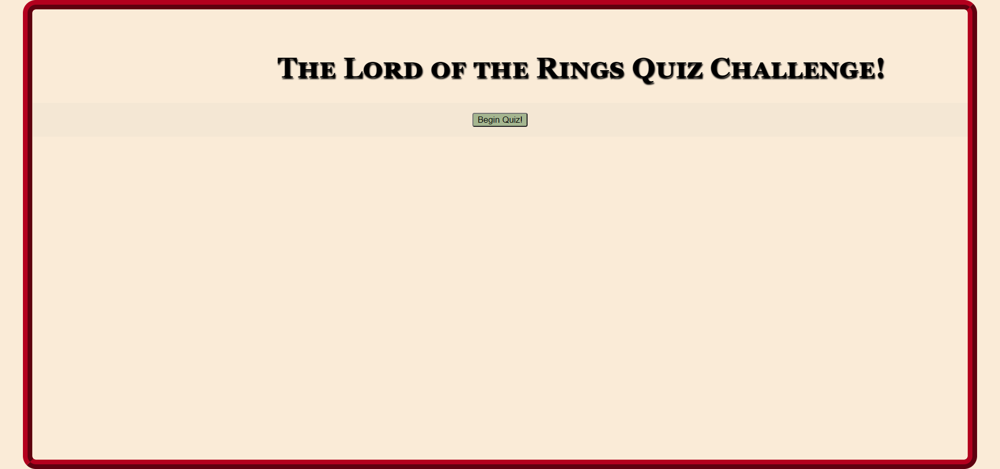

# Coding Quiz Challenge 4
## The Lord of the Rings Quiz
### Scott Nichols

The challenge was to create a multiple choice quiz that was timed and presented questions, one after the other.  My quiz ia a group of questions relating to The Lord of the Rings books and motion pictures.

The quiz includes the following components:
* Opeing page with a button to begin quiz.
* Pressing the button presents the first question and starts the 60 second timer.
* The page continues to present questions as the user inputs their answers.
* With each answer input the player recieves 1 point for a correct answer and loses 5 seconds of time with evey incorrect answer.
* The quiz ends when the full array of questions is completed or the time runs out.
* Upon completion, the player is taken to the high scores page to enter their initials to be stored on the page.
* They are then presented with an opportunity to restart the quiz.

Site URL: https://sessions21.github.io/Coding-Quiz-Challenge4/

